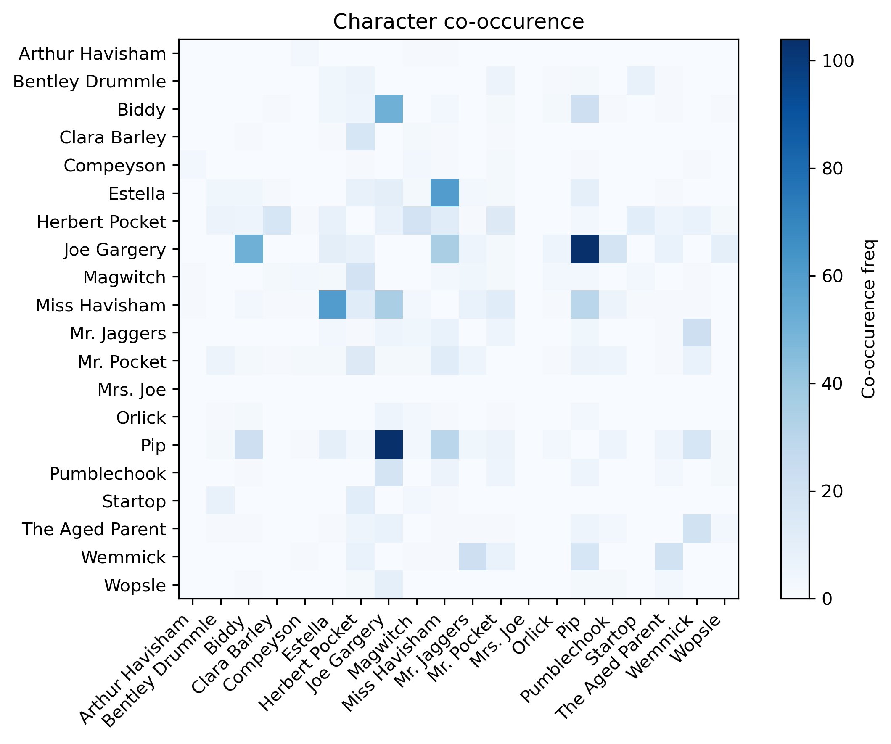

# Literary Analytics of my favourite Classic Novels

In this project I did a **comparative data-driven analysis** of my favourite works of classic literature:

- *Crime and Punishment by Dostoyevsky*
- *Great Expectations by Dickens*
- *The Count of Monte Cristo by Dumas* 

My focus was on quantifying writing style, narrative structure and character dynamics using beginner NLP techniques. The analysis includes detailed token statistics, sentence-level metrics, and character-driven visualizations.

## Key Insights

| Book                       | Total Tokens | Unique Tokens | Type–Token Ratio | Avg Sentence Length |
|---------------------------|--------------|---------------|------------------|----------------------|
| Crime and Punishment      | 203,841      | 9,300         | **0.0456**       | **14.25 words**      |
| Great Expectations        | 183,977      | 10,590        | **0.0575**       | **19.01 words**      |
| Count of Monte Cristo     | 460,447      | 15,686        | **0.0341**       | **17.57 words**      |

- *Great Expectations* has the **richest vocabulary** (highest TTR).
- *Crime and Punishment* uses **shorter sentences**, consistent with psychological intensity.
- *The Count of Monte Cristo* is the most expansive narrative but has the lowest TTR (which is normal because book is very long).

TTR Comparison Bar

Sentence Length Comparison Bar

## Character Mention Analysis

I extracted names of the most important characters of each novel and computed total mention counts.

### Crime and Punishment

- Raskolnikov overwhelmingly dominates mention count, reflecting his central psychological presence.
- Porfiry has strong co-occurence with Raskolnikov, matching the intense investigative dialogue.
- Sonya is the second most-mentioned character, highlighting her role as Raskolnikov's emotional anchor.

### The Count of Monte Cristo

- Dantes overwhelmingly dominates mentions, because he is the central figure across every major plot. His mention could be even higher, because there might be some alliases I haven't covered.
- Villefort and Danglars are primary antagonists in the revenge storyline.
- Mercedes has moderate mentions, because she appears heavily only at the opening and closing acts, far less during the middle.
- Abbe Faria co-occurs only with Dantes, he plays a major role during the prison chapters.

### Great Expectations

- Joe Gargery and Miss Havisham dominate in character mentions, exceeding Pip's mentions.
- Core structural clusters are Pip's releationships with Joe, Herbert, Estella, and Miss Havisham
- Based on the heatmap we can clearly see different phases of Pip's life.

## Comparative Observations

Across all three novels, we can see stylistic and structural differences between Dostoyevsky, Dickens and Dumas. CaP is the most psychologically centered work, it is dominated by one character with tight co-occurrence clusters. 

In contrast, Dickens features the richest vocabulary and logenst sentence structures reflecting Victorian England's emphasis on social detail. His character network forms clear phases of main character's life, each with own distinct cluster of releationships.

Dumas' Monte Cristo exhibits the broadest narrative scale, where protagonist is strongly present but balanced with important antagonists each from separate co-occurrence zones mirroring the novel structure.

If we dive deeper into the Russian, French and English literature works, we can see that Russian works favor psychological depth, English social complexity and French prioritizes dramatic adventure, romance and plot-driven momentum.

| Aspect                          | Crime and Punishment (Dostoevsky)                          | Great Expectations (Dickens)                                 | Count of Monte Cristo (Dumas)                                |
|---------------------------------|-------------------------------------------------------------|--------------------------------------------------------------|--------------------------------------------------------------|
| **Literary Tradition**          | Russian Realism / Psychological Novel                      | English Victorian Literature                                 | French Romantic Adventure                                   |
| **Narrative Focus**             | Intense psychological exploration of a single character     | Social development across phases of life                     | Large-scale revenge epic with multiple arcs                 |
| **Protagonist Dominance**       | Extremely high (Raskolnikov dominates nearly all mentions)  | Moderate (Pip narrates, but many characters contribute)      | High but balanced by multiple major antagonists             |
| **Character Network Structure** | Tight, concentrated, few central relationships              | Segmented into social clusters (childhood, London, Satis)    | Multiple antagonist-centered clusters reflecting revenge arcs |
| **Main Themes (reflected in data)** | Guilt, morality, confession                             | Class mobility, personal growth, identity                    | Revenge, justice, fate, transformation                      |
| **Sentence Length**             | Shorter, direct, psychologically intense                    | Longest, descriptive, highest structural complexity           | Medium-length, fast-paced, action-focused                   |
| **Vocabulary Richness (TTR)**   | Medium                                                       | Highest                                                       | Lowest (due to long adventure structure)                    |
| **Size of Character Cast**      | Small, deeply intertwined                                   | Large, socially diverse                                       | Large with multiple independent arcs                        |
| **Co-occurrence Heatmap**       | Strong central cluster around Raskolnikov                   | Distinct clusters for different life stages                  | Clear arcs: Marseille, prison, Paris antagonists            |
| **Stylistic Identity**          | Psychological realism, moral philosophy                     | Social realism, emotional and class commentary               | Dramatic adventure, plot twists, dramatic contrasts         |

## What has been done

- Sentence tokenization
- Character name extraction
- Co-occurrence matrix
- Heatmap and barplot visualizations
- Comparative narrative statistics

## Next Steps

The project can be expanded in several meaningful ways, such as adding sentiment analysis to model emotional arcs across chapters, incorporating named entity recognition to map places and events, separating dialogue from narration to study character speaking patterns, and performing deeper stylometric comparisons between authors. This will have to wait until I improve my NLP knowledge :)
