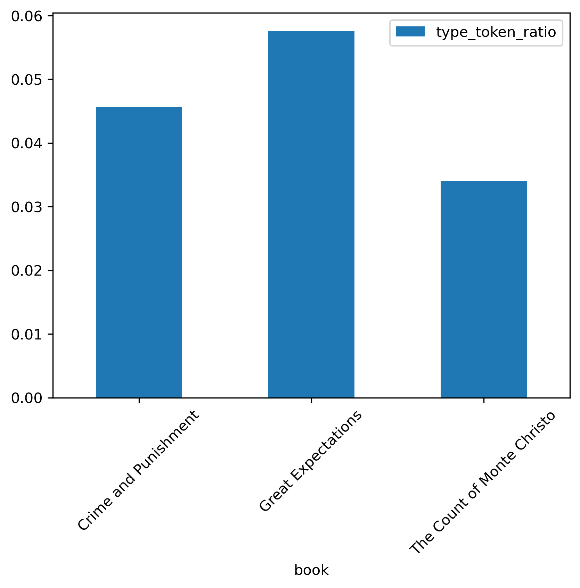
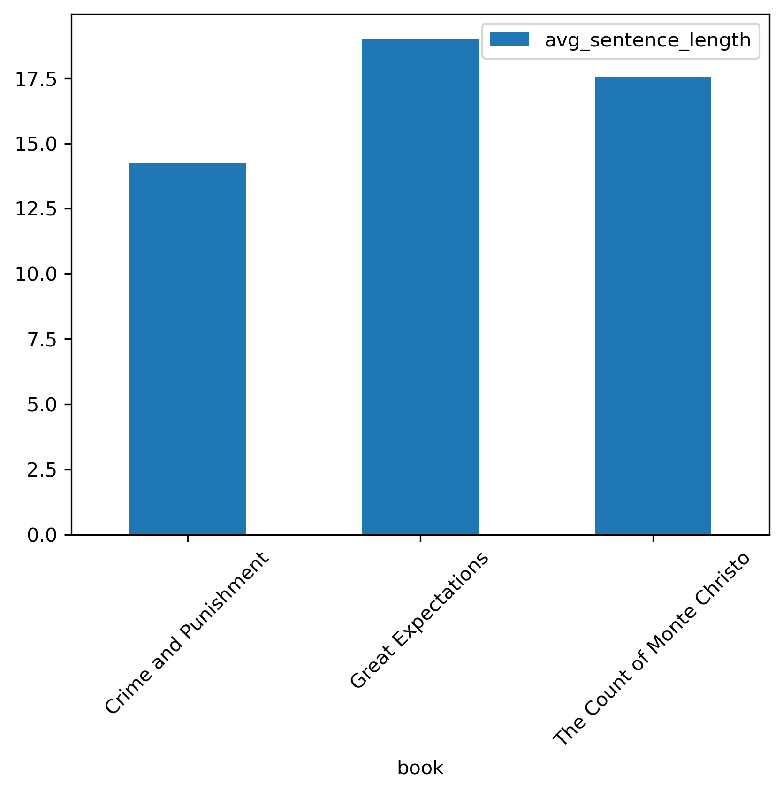
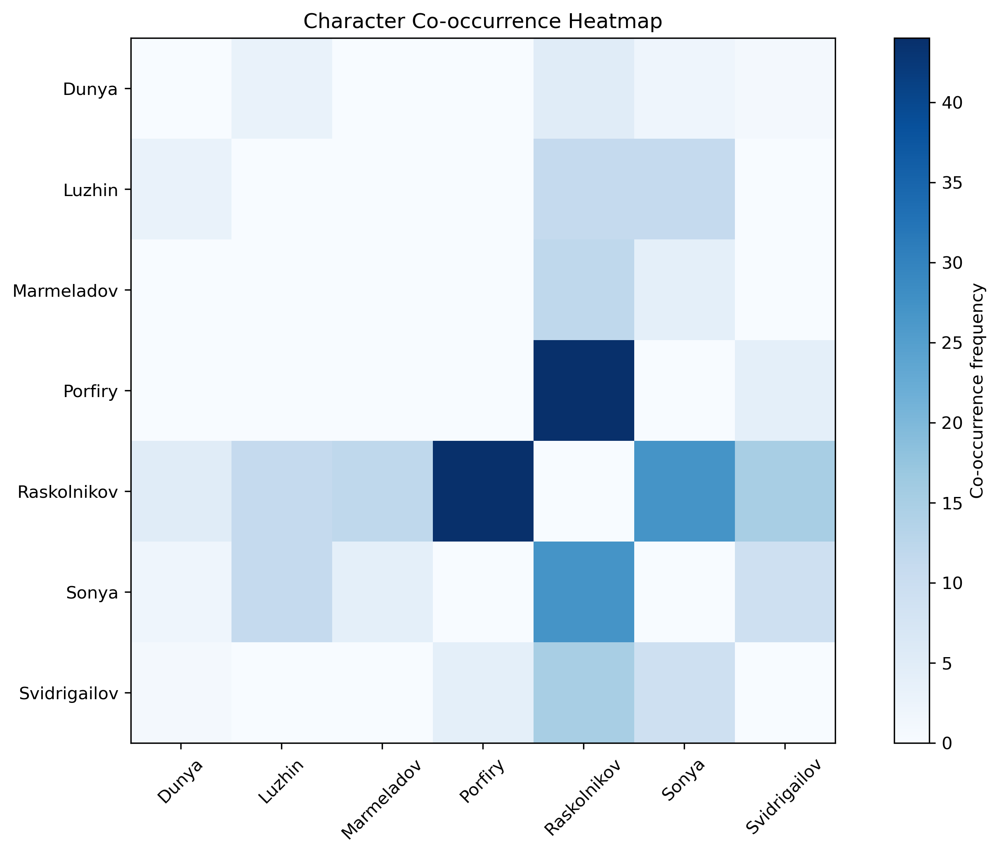
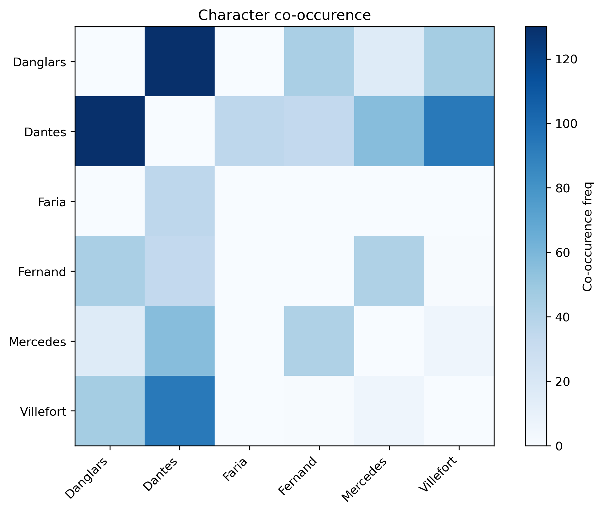

# Literary Analytics of my favourite Classic Novels

In this project I did a **comparative data-driven analysis** of my favourite works of classic literature:

- *Crime and Punishment by Dostoyevsky*
- *Great Expectations by Dickens*
- *The Count of Monte Cristo by Dumas* 

My focus was on quantifying writing style, narrative structure and character dynamics using beginner NLP techniques. The analysis includes detailed token statistics, sentence-level metrics, and character-driven visualizations.

## Key Insights

| Book                       | Total Tokens | Unique Tokens | Type–Token Ratio | Avg Sentence Length |
|---------------------------|--------------|---------------|------------------|----------------------|
| Crime and Punishment      | 203,841      | 9,300         | **0.0456**       | **14.25 words**      |
| Great Expectations        | 183,977      | 10,590        | **0.0575**       | **19.01 words**      |
| Count of Monte Cristo     | 460,447      | 15,686        | **0.0341**       | **17.57 words**      |

- *Great Expectations* has the **richest vocabulary** (highest TTR).
- *Crime and Punishment* uses **shorter sentences**, consistent with psychological intensity.
- *The Count of Monte Cristo* is the most expansive narrative but has the lowest TTR (which is normal because book is very long).

TTR Comparison Bar

Sentence Length Comparison Bar

## Character Mention Analysis

I extracted names of the most important characters of each novel and computed total mention counts.

### Crime and Punishment

- Raskolnikov overwhelmingly dominates mentions
- Sonya, Dunya, and Porfiry form secondary character clusters
- From the heatmap we can see interaction patterns and family circles

### The Count of Monte Cristo

- Edmond Dantes and Villefort appear with high frequencies
- Their strong co-occurence mirrors the central revenge arc
- Heatmap shows clear narrative segmentation 

### Great Expectations

- TBD

## Comparative Observations

- Dostoyevsky writes with short but intense sentences.
- Dickens uses very rich vocabulary and longer descriptive sentences.
- Dumas constructed the largest narrative world with many characters.

## What has been done

- Sentence tokenization
- Character name extraction
- Co-occurrence matrix
- Heatmap and barplot visualizations
- Comparative narrative statistics
